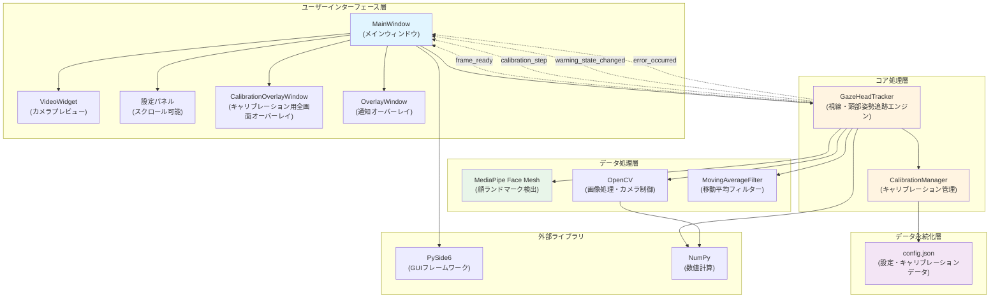
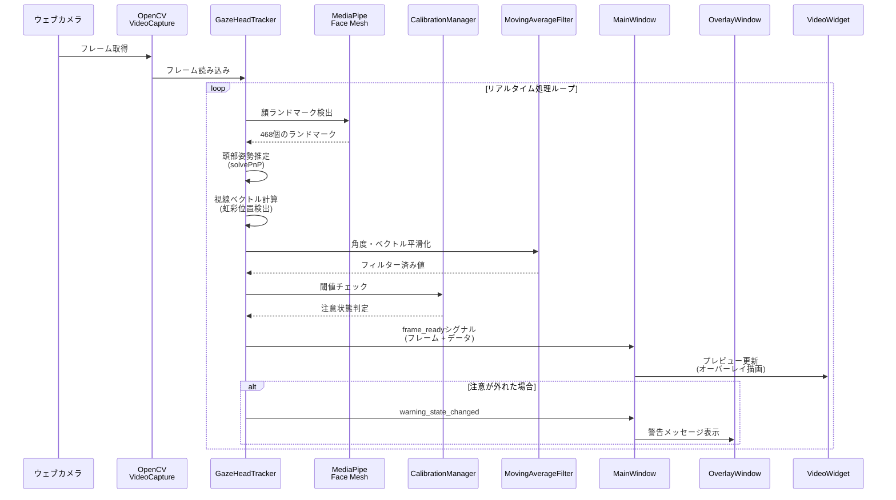
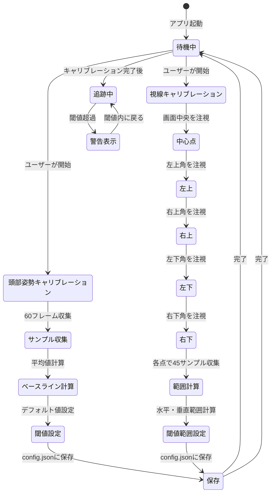
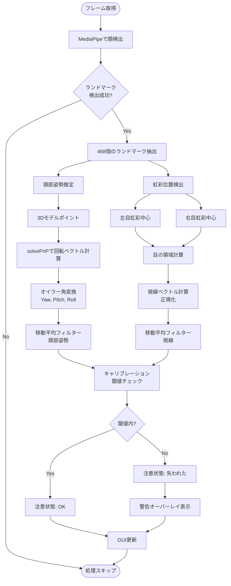
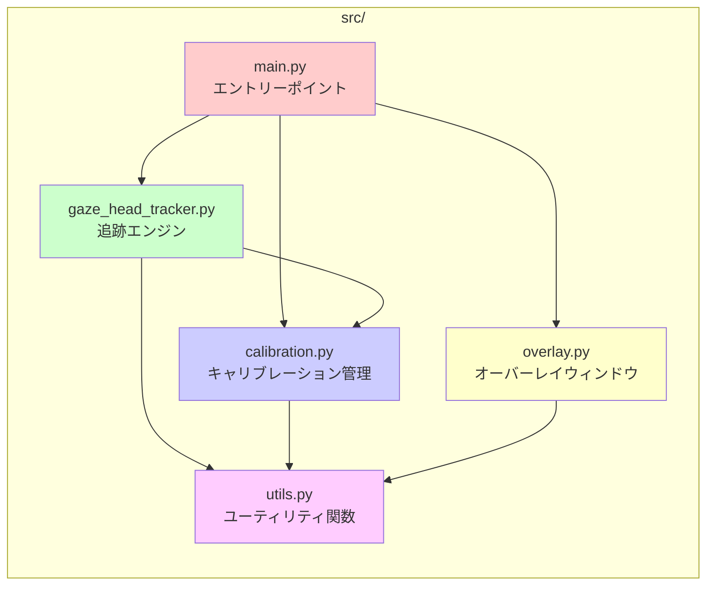
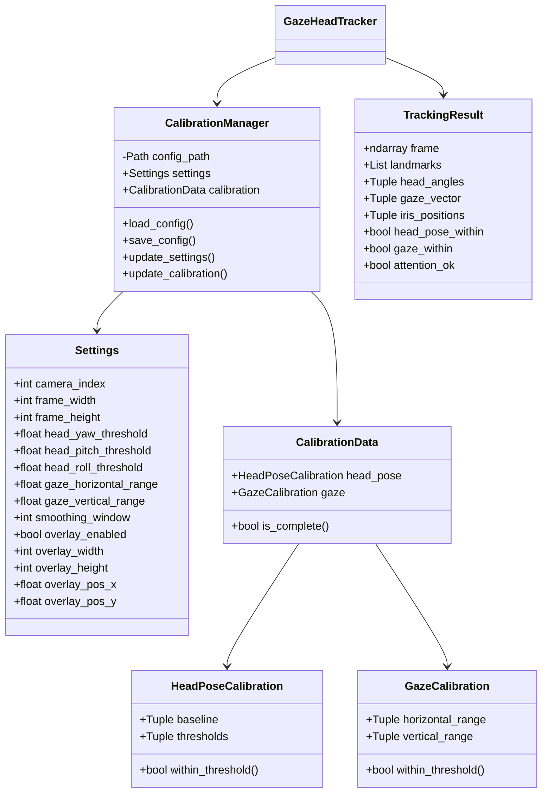
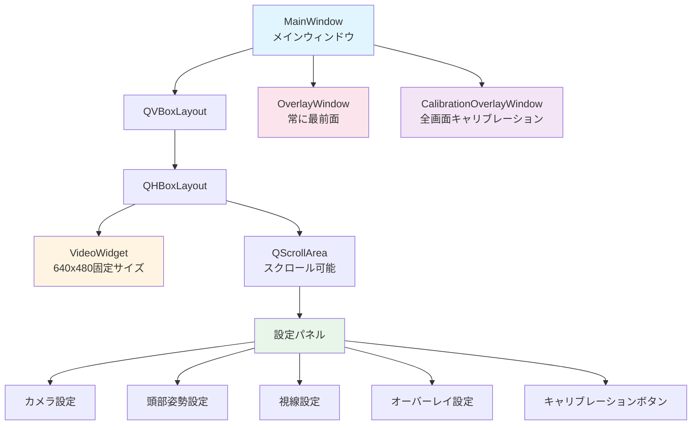
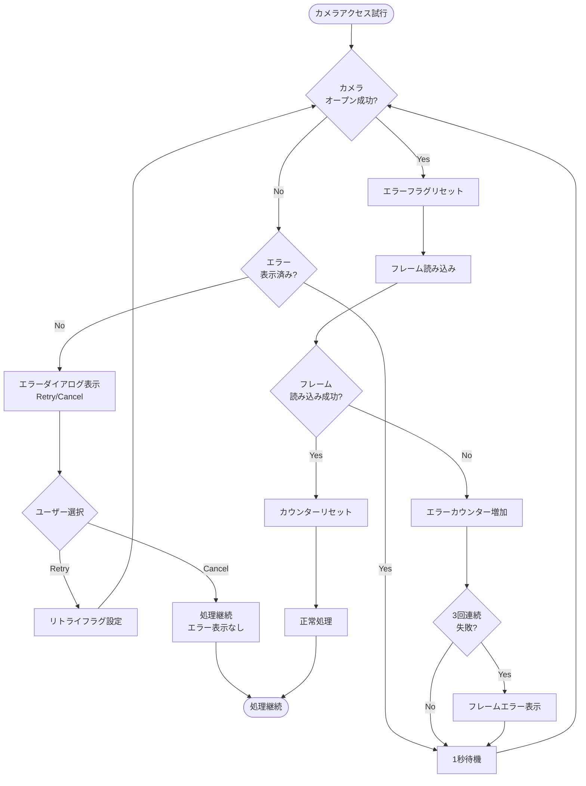
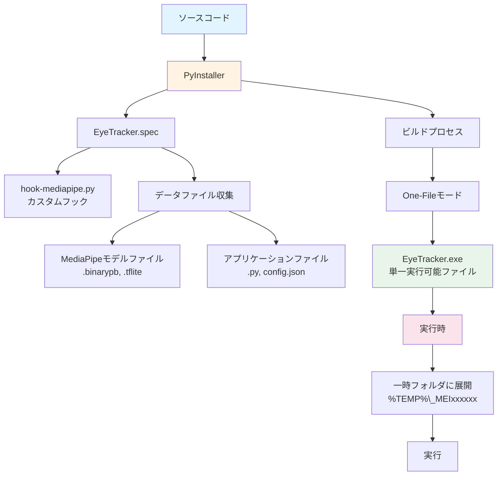

# プロジェクトアーキテクチャ図 (Project Architecture Diagrams)

このドキュメントには、視線追跡アプリケーションのアーキテクチャを説明するMermaidダイアグラムが含まれています。

## システム全体アーキテクチャ

## データフロー図

## キャリブレーションプロセス

## 視線追跡アルゴリズム

## モジュール依存関係

## 設定とデータ構造

## GUIコンポーネント階層

## エラーハンドリングフロー

## ビルドとパッケージング

---

## 用語集

- **ランドマーク (Landmarks)**: 顔の特徴点（468個）
- **頭部姿勢 (Head Pose)**: 頭の向き（Yaw: 左右, Pitch: 上下, Roll: 傾き）
- **視線ベクトル (Gaze Vector)**: 視線の方向（水平・垂直）
- **虹彩 (Iris)**: 目の瞳孔周辺の色のついた部分
- **キャリブレーション (Calibration)**: 個人差に合わせた調整
- **閾値 (Threshold)**: 判定の境界値
- **移動平均フィルター (Moving Average Filter)**: 値の平滑化
- **オーバーレイ (Overlay)**: 他のウィンドウの上に表示される透明ウィンドウ

